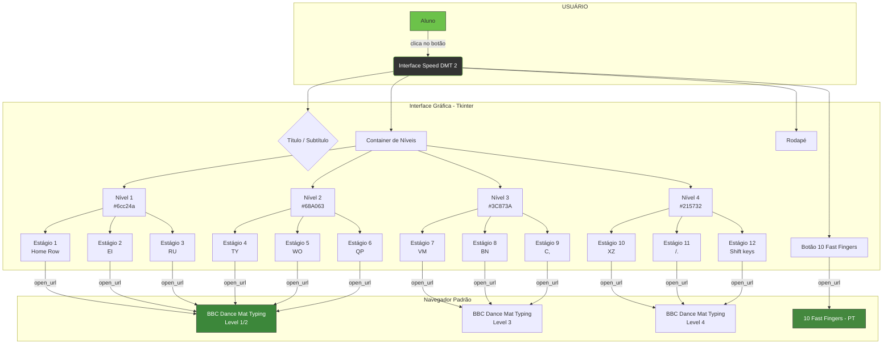

# Documentação - Speed DMT 2

## Visão Geral

Aplicação desktop em Python (Tkinter) que centraliza o acesso aos estágios do **Dance Mat Typing** (BBC) e ao **10 Fast Fingers**, permitindo que alunos de diferentes níveis pratiquem digitação diretamente pelo navegador.

---

## Diagrama Lógico do Serviço



---

## Estrutura do Código

```
ProjetoPy/
├── dancemat_typing.py    # Código fonte principal
├── icon.ico              # Ícone personalizado
├── version_info.txt      # Metadados de versão para o .exe
├── Speed DMT 2.exe       # Executável compilado (PyInstaller)
└── DOCUMENTACAO.md       # Este arquivo
```

### `dancemat_typing.py` — Fluxo de Execução

```
01. Importação das bibliotecas
    ├── tkinter / ttk     → Interface gráfica
    ├── webbrowser         → Abrir URLs no navegador
    ├── ctypes             → API do Windows (ícone na barra de tarefas)
    ├── os / sys           → resource_path para PyInstaller
    ├── threading / json / → Auto-update via GitHub API
    │   urllib / subprocess

02. Constantes e funções auxiliares
    ├── resource_path()     → Localiza arquivos dentro do .exe (onefile)
    ├── BUILD_TIMESTAMP     → Data de build para comparar atualizações
    ├── _get_exe_path()     → Localiza o executável atual
    ├── _check_update()     → Thread: consulta último commit no GitHub
    └── _apply_update()     → Baixa .exe, cria .bat de substituição e reinicia

03. Constantes de cor
    ├── COR_FUNDO     → #333333 (cinza escuro)
    ├── COR_TITULO    → #6cc24a (lime green)
    ├── COR_NIVEL1..4 → gradiente verde claro → escuro
    └── COR_EXTRA     → #44883e (botão 10fastfingers)

04. URLs dos estágios
    ├── URL_LEVEL1 → level 1 (estágios 1-3)
    ├── URL_LEVEL2 → level 2 (estágios 4-6)
    ├── URL_LEVEL3 → level 3 (estágios 7-9)
    └── URL_LEVEL4 → level 4 (estágios 10-12)

05. Dicionário stages
    └── Mapeia cada nível → (cor, [(nome_estágio, url), ...])

06. Funções da interface
    ├── open_url(url)               → webbrowser.open()
    ├── criar_botao_arredondado()   → Canvas com cantos arredondados
    ├── criar_label_responsivo()    → Label com wraplength dinâmico
    ├── _set_app_icon()             → Ícone na barra de tarefas (Win32 API)
    └── _check_update / _apply_update → Auto-update

07. Configuração da janela (19:9 centralizado)
    ├── root.geometry(...)  → tamanho proporcional à tela
    └── root.minsize(800, 480)

08. Construção da interface
    ├── main (Frame) → título + subtítulo
    ├── container    → níveis com botões arredondados
    ├── btn_10fast   → botão extra
    └── rodape       → texto informativo

09. root.mainloop() → loop de eventos Tkinter
```

---

## Mecanismo de Botão Arredondado

Cada botão é um `tk.Canvas` que desenha:

1. **4 arcos** (um em cada canto, 90° cada)
2. **2 retângulos** (horizontal e vertical, conectando os arcos)
3. **Texto centralizado** com `width` para wrap

Isso produz cantos arredondados visualmente suaves sem depender de imagens externas.

```
┌───────┬───────────────────┬───────┐
│   ◜   │                   │   ◝   │
├───────┤                   ├───────┤
│       │     TEXTO         │       │
├───────┤                   ├───────┤
│   ◟   │                   │   ◞   │
└───────┴───────────────────┴───────┘
```

---

## Responsividade

- **Labels**: evento `<Configure>` atualiza `wraplength` dinamicamente
- **Botões Canvas**: evento `<Configure>` redesenha o botão na nova largura
- **Container**: `expand=True` + `fill=BOTH` ocupa espaço vertical disponível
- **Tamanho mínimo**: 800×420px para evitar colapso visual

---

## Cores (Tema Verde)

| Token            | Código   | Descrição                 |
|------------------|----------|---------------------------|
| `COR_FUNDO`      | #333333  | Preto Pérola (fundo)      |
| `COR_TITULO`     | #6cc24a  | Verde-Limão (título)      |
| `COR_SUBTITULO`  | #68A063  | Verde-Musgo (subtítulo)   |
| `COR_NIVEL1`     | #6cc24a  | Lime Green                |
| `COR_NIVEL2`     | #68A063  | Mustard Greens            |
| `COR_NIVEL3`     | #3C873A  | Cobalt Green claro        |
| `COR_NIVEL4`     | #215732  | Cobalt Green escuro       |
| `COR_EXTRA`      | #44883e  | Mustard Greens escuro     |
| `COR_BOTAO_TEXTO`| #FFFFFF  | Branco (texto botões)     |

---

## Como Compilar o .exe

```powershell
pip install pyinstaller
python -m PyInstaller --onefile --noconsole --noupx `
    --name "Speed DMT 2" `
    --icon=icon.ico `
    --add-data "icon.ico;." `
    --version-file version_info.txt `
    --distpath "Caminho\Para\ProjetoPy" `
    dancemat_typing.py
```

- `--onefile`: Gera um único .exe portátil
- `--noconsole`: Oculta o terminal ao executar
- `--noupx`: Desativa UPX (reduz alarmes falsos de antivírus)
- `--icon=icon.ico`: Ícone do arquivo .exe no Explorer
- `--add-data "icon.ico;."`: Embute o .ico dentro do .exe onefile
- `--version-file`: Adiciona metadados (empresa, descrição, versão) ao .exe

---

## Requisitos

- Python 3.6+
- Bibliotecas padrão: `tkinter`, `webbrowser`
- (Nenhuma instalação adicional necessária)
